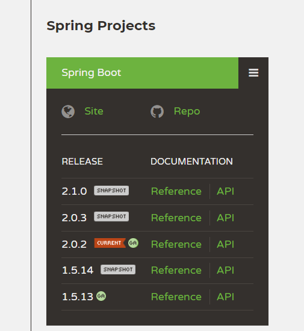

## 시작하며
Spring boot로 간단한 웹서비스를 구축하는 튜토리얼을 진행 중이다. ([tutorial](http://jojoldu.tistory.com/250?category=635883))  
작업을 하면서 내장(embedded) 데이터베이스인 `H2`를 처음 접했는데, web-console로 아무리 접속해도 내가 생성한 테이블이 보이지 않았다. 문제는 JDBC Url을 `jdbc:h2:mem:testdb`로 설정하지 않아서 였다. 
* 데이터베이스명은 따로 설정하지 않으면 testdb로 설정된다. ([참고1](https://stackoverflow.com/questions/44446597/where-does-the-default-datasource-url-for-h2-come-from-on-spring-boot), [참고2](https://stackoverflow.com/questions/24655684/spring-boot-default-h2-jdbc-connection-and-h2-console))
* jvm에 내장된 형태의 데이터베이스를 사용하려면 mem 으로 설정한다. (이외에도 서버형, 혼합형이 있다. [참고](http://www.h2database.com/html/features.html))
* jdbc url 규칙 :  `jdbc:[DBMS이름]:[데이터베이스식별자]`  

문제는 해결했는데 이를 찾아보는 과정에서 Datasource, embedded db 등 기본적인 내용인 것 같은데 확실시 와닿지가 않았다. 이 기회에 하나씩 정리해보자.
## Datasource
순수 `jdbc`로 데이터베이스에 접근을 하면, 데이터베이스에 접근할 때마다 connection을 맺고 끊는 작업을 한다. 이 connection을 맺고 끊는 작업을 줄이기 위해 미리 connection을 생성해 두고, 데이터베이스에 접근하고자 하는 사용자에게 미리 생성된 connection을 제공하고 돌려받는다. 이 connection들을 모아두는 장소를 `connection pool`이라 하며, `Datasource`는  java 에서 connection pool을 지원하기 위한 인터페이스이다. 
```java
import javax.sql.DataSource;
```
Spring boot는 `WAS`(tomcat)가 내장되어 있다. Datasource를 직접 구현하여 사용할 수 있지만, 코드 내에서 connection을 모두 관리하는 것은 비효율적이다. 이유는 하나의 WAS에 여러가지 프로그램이 실행될 수 있으며, 이 모든 프로그램마다 각각의 Datasource를 가지고 connection을 관리한다면 개발자 또는 운영자가 전체를 관리하기 힘들어 진다. 그래서 WAS내에서 모든 connection을 관리하는 방법이 효율적이며, spring boot 또한 내장되어 있는 WAS에 connection pool을 제공한다.
## Spring boot 의 Datasource
Spring boot는 `staters`를 dependency에 추가하면 자동으로 Datasource 관리를 위한 구현체를 제공한다. 버전에 따라 default로 제공하는 구현체는 다르다.  
> Spring boot version  
> 1.5.14 : `tomcat-jdbc`  
> 2.0.2 : `HikariCP`  
 
관련된 내용은 Spring boot reference에 있으므로 참고하자. 목차는 29.1. Configure a DataSource 에 있다.    
>[Spring boot reference](https://spring.io/docs/reference)  



## Datasource properties
application.properties(또는 .yml)에서 Datasource 설정이 가능하다.
```yml
# 기본속성

spring.datasource.url= # JDBC URL of the database.
spring.datasource.username= # Login username of the database.
spring.datasource.password= # Login password of the database.
spring.datasource.driver-class-name= # Fully qualified name of the JDBC driver. Auto-detected based on the URL by default.
```
아래는 Datasource별 속성이다. pool의 max size, wait size 등을 설정할 수 있다. 아래는 tomcat으로 되어있지만 tomcat 대신 hikari, dbcp2를 넣어 사용할 수 있다. (`spring.datasource.종류.속성명=값` 으로 사용가능)
```yml
# datasource별 속성

# Number of ms to wait before throwing an exception if no connection is available.
spring.datasource.tomcat.max-wait=10000

# Maximum number of active connections that can be allocated from this pool at the same time.
spring.datasource.tomcat.max-active=50

# Validate the connection before borrowing it from the pool.
spring.datasource.tomcat.test-on-borrow=true
```
더 많은 속성들은 Spring boot reference 문서를 참고하자.

## 끝으로
키워드로 이것저것 찾아가며 여러 포스트를 읽는 것도 많은 도움이 되지만 각각의 공식 doc을 보는 것이 제일 도움이 많이 됐던 것 같다. 왠만한 내용은 어느 게시글보다 자세하가 작성되어있는 것 같다. 공식문서를 먼저 읽어본 후 구글링 하자.  
추가로 문서로만 이해하려고 하다보니 감을 잡는데 꽤나 걸리고, 관련 배경지식을 보는데도 상당히 볼 것이 많다. 일단은 아는 것이 없으니 다 보는데 기록은 확실히 해두자. 그리고 왠만하면 직접 구현하면서 익히자.

## 참고
Spring boot reference : https://spring.io/docs/reference  
Spring boot properties : https://docs.spring.io/spring-boot/docs/current/reference/html/common-application-properties.html  
H2 database : http://www.h2database.com/html/features.html