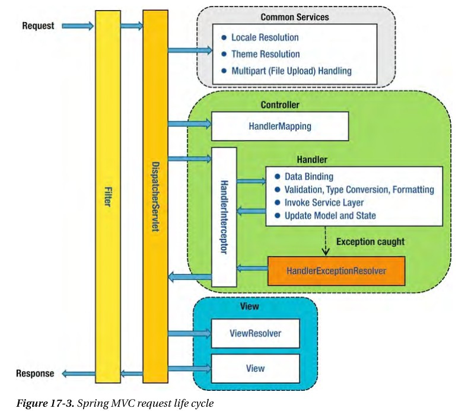

### 시작하며
외부에서 내가 개발한 API를 호출하는 경우가 있다. 이때 허용한 곳에서만 내 API를 호출하도록 검증하는 과정이 필요하다.  
1차적으로는 내 서버에 접속하는 IP를 제한하고, API 내에서도 인증코드 등으로 검증할 수 있다. 스프링 부트에서는 이 검증을 어떻게 해야할지 고민을 한 과정을 적어본다.  
일단 상황은 외부에서는 POST로 요청하며 BODY에 인증코드와 기타 파라미터들을 담아서 넘겨주는 형태였다.

### Spring Filter or Intercepter
첫 번째로 고민은 필터냐 인터셉터냐를 고민했다. 필터와 인터셉터 모두 요청에 대한 전후처리가 가능하고, 특정 조건에서만 로직을 수행할 수 있는 공통점이 있다. 차이는 실행 위치이다.  
인터셉터는 DispatcherServlet 내에 있고 필터는 밖에서 동작한다. 이러한 차이때문에 인터셉터에서는 특정 컨트롤러에서만 동작하는 로직을 추가할 수 있다.  
외부에서 접근하는 API들을 별도의 컨트롤러로 분리한 뒤 그 컨트롤러로 오는 요청에서만 처리하도록 하기 위해 일단 인터셉터를 선택했다.  


### Intercepter 와 HttpServletRequest
인터셉터를 생성하고 해당 컨트롤러에서 인증코드를 검증하는 로직을 추가했다. 그런데 테스트를 진행하면서 Request 내용이 null이라는 에러가 발생했다.  
또 테스트 과정에서 요청을 보내도 인터셉터 내에서 HttpServletRequest를 로그를 한번 찍은 후 로직을 수행하면 로그에는 찍히지만 로직에서는 빈 값이 넘어갔다.  
이 과정에서 위의 Stream은 한번만 읽을 수 있다는 내용을 알게 됐다. 필터에서는 이미 로그인 인증을 위해 내용을 읽고 있는데 어떤 차이가 있는지 살펴봤다.  
로그인 인증코드는 헤더에 담겨서 넘어오고 현재 테스트하는 API의 인증코드는 바디에 담겨서 넘어왔다. 로그인의 인증코드는 유효시간이 있기때문에 헤더에 담아 보내도 문제가 되지 않지만 API의 인증코드는 그렇지 않았다. 또한 이미 바디에 담아서 보내는 내용으로 약속이 되어서 이를 바꾸는데도 힘들 것 같았다. 결국 이 검증로직을 인터셉터에서 사용할 수 없게 됐다.

### AOP
마지막으로 생각한 것은 Aspect로 추가하는 방법이다. 사실 가장먼저 생각했던 방법이지만 필터나 인터셉터를 공부할 겸 적용해보고자 했지만 결국 실패했다.  
AOP에 추가하면 컨트롤러는 깔끔해진다. 중복 로직을 AOP로 분리하기 때문이다. 하지만 이 사실을 모르는 동료개발자는 이 검증로직이 있다는 내용을 놓칠 가능성이 매우 크다. AOP를 사용하면 내가 보기에 깔끔한 코드를 만들었지만 여러명이 사용하기엔 디버깅이나 원작자의 의도를 빨리 알아채기 힘들 수 있다.  
그래도 일단은 이 컨트롤러는 내가 담당이고 엄청난 로직이 추가된 것도 아니고, 예외처리도 해놓았기 때문에 혹시나 누군가 설명없이 이 코드를 보더라도 한두번만 테스트해도 검증로직이 있다는 내용을 알 수 있을 것이다.  
```java
@Before("execution(* com.api.controller.TestController.*(..))") //해당 컨드롤러에 있는 모든 API실행 전에 수행
    public void checkCode(JoinPoint joinPoint) {

        String code = (String) joinPoint.getArgs()[0]; //get args

        if (code.compareTo(TEST_CODE) == 0) { //check code
            //sucess
        } else {
            //fail
            throw new RuntimeException("인증실패");
        }
    }
```

### 마치며
스프링을 쓰는 과정은 서비스 로직을 잘 구현하고, 컨트롤러를 잘 설계하고, 데이터를 잘 조회하는 작업이 대부분이다. 이런 경우가 아니라면 수많은 스프링의 디테일한 기능과 구조를 파악하고 사용해보기 힘들다. 항상 스프링에는 모든 것이 구현되어 있고 추상화 되어있다를 잘 기억하고, 상황에 맞게 어떤 방법을 사용하면 좋은지 고민해야겠다. 그전에 어떤 것이 있는지도 알아놔야 쓸테니깐 스프링문서를 자주 봐야겠다.  
너무 오랜만에 썼다. 바쁘다는 핑계로 적어도 일주일에 한번은 쓰자고 했던 다짐도 다 어겼다. 주말에 한시간만 투자하면 한주에 가장 많이 고민했던 내용을 정리할 수 있는데 한달이 넘게 핑계만 댔다. 다시 차근차근 해보자.

### 참고
https://supawer0728.github.io/2018/04/04/spring-filter-interceptor/  
https://stackoverflow.com/questions/21193380/get-requestbody-and-responsebody-at-handlerinterceptor  
https://stackoverflow.com/questions/10457963/spring-rest-service-retrieving-json-from-request/10458119#10458119  