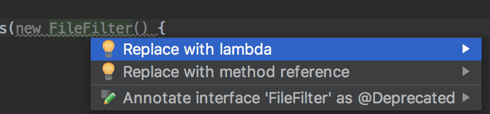

### 시작하며
java8이 나온지가 몇년인데 아직도 모르는건 심각하다.(조만간 11이 나옴..) 이래놓고 java 개발자라고 하기 민망하다. java8에서 새로나온 람다, 스트림 등을 공부해서 써보자. 공부는 [이 책](http://www.kyobobook.co.kr/product/detailViewKor.laf?ejkGb=KOR&barcode=9788968481796)으로 한다.    


### chapter1
java8에서는 크게 보면 '스트림 API', '메서드에 코드를 전달하는 기법(메서드 레퍼런스, 람다)', '인터페이스의 디폴트 메서드' 이렇게 3개의 특징이 추가됐다.  
>**함수, 메서드**  
병렬프로그래밍을 활용할 수 있는 스트림과 연계될 수 있도록 함수 설계, 함수가 값, java8에서 메서드는 1급객체이다.

>**1급객체** [(출처)](https://medium.com/@lazysoul/functional-programming-%EC%97%90%EC%84%9C-1%EA%B8%89-%EA%B0%9D%EC%B2%B4%EB%9E%80-ba1aeb048059)  
>변수나 데이타에 할당 할 수 있어야 한다.  
>객체의 인자로 넘길 수 있어야 한다.  
>객체의 리턴값으로 리턴 할수 있어야 한다.    

 
다음은 메서드 레퍼런스와 람다를 이용해서 메서드에 코드를 넣는 방법을 디렉토리에서 숨겨진 파일을 필터링하는 샘플이다.
```java
/*
 * new FileFilter() 인스턴스를 생성해서 값을 전달해야 한다.
 * isHidden() 메서드를 사용하기 위해 FileFilter 객체로 감싼 다음에 이 객체를 File.listFiles()로 전달한다.
 */
File[] hiddenFiles = new File(".").listFiles(new FileFilter() {
            @Override
            public boolean accept(File file) {
                return file.isHidden();
            }
        });
```
친절하게 quick fix가 나온다.  

```java
//메서드 레퍼런스를 만들어 전달
File[] hiddenFiles = new File(".").listFiles(File::isHidden);
```
```java
//람다식 활용
File[] hiddenFiles3 = new File(".").listFiles(file -> file.isHidden());
```
다음은 스트림 API를 이용하여 순차,병렬처리 하는 샘플이다.
```java
List<Apple> heavyApples = inventory.stream().filter((Apple a) -> a.getWeight() > 150)
                                            .collect(toList());

List<Apple> heavyApples = inventory.parallelStream().filter((Apple a) -> a.getWeight() > 150)
                                            .collect(toList());
```


### 참고
https://medium.com/@lazysoul/functional-programming-%EC%97%90%EC%84%9C-1%EA%B8%89-%EA%B0%9D%EC%B2%B4%EB%9E%80-ba1aeb048059  