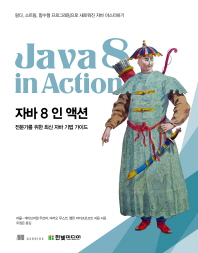

### 시작하며
chapter2에서는 메서드에 동작(코드 블록)을 전달하는 방법을 봤다. 이는 동작파라미터화 라는 용어로 설명하고 있으며, 변화하는 요구사항에 효과적으로 대응하는 방법이다. java8 이전 버전에서는 어떠한 동작을 실행하기 위해서는 간단히 메서드를 만들 수 있다. 또한 클래스로 감싸서 코드 블럭을 전달하거나 인터페이스를 만들어서 동작을 파라미터로 전달할 수 있었다. `java8` 에서는 이러한 동작파라미터화를 람다식과 메서드 레퍼런스라는 새로운 문법으로 지원한다. 기존 방식보다 훨씩 직관적이고, 코드가 간결해짐을 예제로 살펴봤다. 이번 `chapter3` 에서는 람다식과 메서드 레퍼런스가 어떻게 동작하는지까지 살펴본다. 이번 chapter도 천천히 예제를 실행해보면서 진행해보자.  
  

### chapter3
**람다 표현식** : 메서드로 전달할 수 있는 익명 함수를 단순화한 것으로 다음과 같은 특징을 가진다.
* 익명 : 일반 메서드와 달리 이름이 없다.
* 함수 : 메서드처럼 특정 클래스에 종속되지 않으므로 '함수' 라고 부른다. (파라미터 리스트, 바디, 반환형식, 예외리스트는 포함한다.)
* 전달 : 람다 표현식을 메서드의 파라미터로 전달하거나 변수로 저장할 수 있다.
* 간결성 : 구현할 코드가 줄어든다.

간단한 코드를 살펴보면, 아래는 사과의 무게를 비교하는 방법이다.
```java
//java8 이전
Comparator<Apple> byWeight = new Comparator<Apple>() {
    public int compare(Apple a1, Apple a2) {
        return a1.getWeight().compareTo(a2.getWeight());
    }
}
```
```java
//java8+
Comparator<Apple> byWeight = (Apple a1, Apple a2) -> a1.getWeight().compareTo(a2.getWeight());
```
하나씩 살펴보면, 다음과 같다.
1. `(Apple a1, Apple a2)` : 람다 파라미터
1. `->` : 람다의 파라미터 리스트와 바디를 구분
1. `a1.getWeight().compareTo(a2.getWeight());` : 람다 바디

아래는 몇가지 추가 샘플이다.
```java
//String 파라미터 하나를 가지고, int를 리턴한다. (return문은 함축되어 있으므로 명시하지 않아도 된다.)
(String s) -> s.length();

//Apple 형의 파라미터를 하나 가지고, boolean을 리턴한다.
(Apple a) -> a.getWeight > 150;

//int 형식의 파라미터 2개를 가지고, 리턴값은 없다. (여려행을 포함할 수 있다.)
(int x, int y) -> {
    System.out.println("Result");
    System.out.println(x+y);
}

//파라미터가 없고, int를 반환한다.
() -> 42;

//Apple 형의 파라미터를 2개를 가지고, int를 반환한다.
(Apple a1, Apple a2) -> a1.getWeight().compareTo(a2.getWeight());
```
이번에는 람다 문법의 잘못된 예제를 살펴보자.
```java
(Integer i) -> return "number" + i;
//return 키워드는 흐름제어문이므로 {return "number" + i;} 가 되야 한다.

(String s) -> {"str str";}
//"str str"는 구문(statement)이 아니라 표현식(expression)이다. 따라서 "str str"; 또는 {return "str str";} 가 되야 한다.
```

### 함수형 인터페이스
함수형 인터페이스는 하나의 추상 메서드를 가지는 인터페이스이다. 예로는 앞서 살펴본 `java.util.Comparator`, `java.lang.Runnable` 이 있다. 각각 `compare()`, `run()`을 추상 메서드를 하나씩 가진다. (참고로 디폴트 메서드가 여러개 있어도 추상 메서드가 단 한개만 있으면 함수형 인터페이스이다. 9장에 나온다고 한다.)  
  
람다식으로 함수형 인터페이스의 한개 있는 추상메서드를 구현하여 전달할 수 있으므로 람다식은 함수형 인터페이스의 인스턴스가 된다. 이 말을 코드로 살펴보자.
```java
Runnable r1 = () -> System.out.println("hello 1"); //람다 식을 변수(r1)에 할당한다.

Runnable r2 = new Runnable() {
    public void run() {
        System.out.println("hello 2"); //코드를 전달하기 위해 익명클래스를 사용한다. 익명클래스의 인스턴스를 변수 r2에 할당한다.
    }
}

public static void process(Runnable r) {
    r.run();
}

process(r1);
process(r2);
process(() -> System.out.println("hello 3")); //람다식을 직접 전달한다.
```
출력 결과는  
hello 1  
hello 2  
hello 3  
가 차례로 출력된다. 위 코드의 `r1` 과 마지막 `process`를 보면 람다식 자체가 `r2`의 `new Runnable()` 과 같이 인터페이스의 인스턴스가 되어 `process(Runnable r)`의 파라미터로 전달됨을 볼 수 있다. **람다식은 함수형 인터페이스의 인스턴스이며 메서드의 파라미터로 전달된다.**

###

### 마치며


### 참고
 