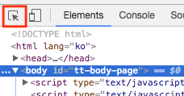
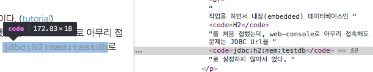

### 시작하며
css에는 `selector`라는 중요한 개념이 있다. 다양한 selector를 단독 또는 조합하여 html element의 스타일을 변경한다. 블로그의 스킨을 편집하던 중 code 태그 중에서 class라는 속성이 있느냐 없느냐를 구분하고 싶었다.  
이유는 포스트를 마크다운으로 작성하는데, 강조와 코드삽입 둘 다 code라는 태그로 감싸져 있었다. 나는 강조에만 색을 넣고 싶었으나, 두 개가 같은 태그여서 두 개의 색상이 같아졌다. 다행히 코드삽입에는 class 속성이 있었고, 이로 구분하면 되겠다고 생각했다.  
즉, code라는 태그에서 class라는 속성이 없는 element만 색을 칠하면 된다.

### Element 찾기
크롬 개발자 모드를 사용하면 element를 쉽게 찾을 수 있다. 개발자 모드는 윈도우는 `F12`, 맥은 `command+option+i` 로 열수 있다. 개발자 도구를 연 후 빨간 네모박스를 클릭하면 현제 페이지의 항목들을 선택할 수 있다. 항목을 선택하면 해당 항목을 html 파일에서 찾아준다.  
   
   


### css 수정하기
code라는 태그에서 class라는 속성이 없는 것을 선택해야한다. 일단 코드라는 태그를 선택하기 위해서는 태그선택자를 사용한다.
```css
code { }
```
다음으로 code 태그 중 class라는 속성을 가진 element를 찾기 위해 속성선택자를 사용한다.
```css
code[class] { }
```
마지막으로 :not() 선택자를 사용하여, class라는 속성이 없는 element를 선택한다.
```css
code:not([class]) { }
```
css에서 selector 사용은 정말 중요한 것 같다. 잘 알고 사용하지 않으면 원하는 결과를 얻기 힘들다. 간단한 수정이기 때문에 큰 어려움은 없었지만 조금만 복잡해져도 수정하기가 어렵다... 잘 짜여진 css를 보며 왜 이렇게 썼는지 분석해 봐야겠다.

### 끝으로
코드와 강조를 구분은 했지만, 아직 코드가 단색으로 나온다. 다음엔 티스토리에서 코드 하이라이터를 사용하는 방법을 알아봐야 겠다.

### 참고
http://www.nextree.co.kr/p8468   
https://webisfree.com/2015-11-13/[css]-not-%EC%84%A0%ED%83%9D%EC%9E%90-%EC%82%AC%EC%9A%A9%EB%B0%A9%EB%B2%95
