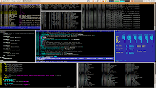
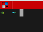

### 시작하며
리눅스 민트(Mint)를 개발PC OS로 사용하면서 터미널로 `terminator` 사용하게 됐다. 탭을 만들고, 분할 화면으로 사용하기 편하고 동시에 입력하는 기능(broadcast)도 가능하다. 기본적인 설정 방법, 단축키, 사용법을 알아둬야겠다.  


###  설정
config 파일 경로는 `/home/jypark/.config/terminator` 아래에 있다. 굳이 config 파일로 안해도 터미네이터 콘솔창에서 `마우스우클릭>환경설정` 에서도 가능하다.
```
[global_config]
  focus = system
  handle_size = 0
[keybindings]
[layouts]
  [[default]]
    [[[child1]]]
      parent = window0
      profile = default
      type = Terminal
    [[[window0]]]
      parent = ""
      size = 1000, 600
      type = Window
[plugins]
[profiles]
  [[default]]
    background_darkness = 0.9
    background_image = None
    background_type = transparent
```

### Gruop, Broadcast (여러 탭에 동시에 입력하기)
터미네이터에서는 여러 개로 분할 된 터미널에 동시에 같은 명령어를 입력할 수 있다. 방법으로는 현재 오픈 된 모든 터미널에 같은 내용을 입력하는 방법과 터미널을 그룹으로 묶어 같은 그룹에만 같은 명령어를 실행하는 방법이 있다.  

**Broadcast All**  
터미널 타이틀의 좌측 상단에 버튼을 누르고, `Broadcast all` 을 선택한다.(단축키 `Alt + A`) 그러면 현재 오픈된 터미널의 타이틀이 같은 색으로 변하면서 동시에 입력이 가능한 상태가 된다. 주의할 점은 현재 켜져 있는 **탭** 도 모두 동시에 입력된다.  
 < `좌측상단버튼`   

**Broadcast Group**  
마찬가지로 터미널 타이틀의 좌측 상단에 버튼을 누르고, `Broadcast group`을 선택한다.(단축키 `Alt + G`) 그리고 원하는 터미널을 같은 그룹으로 묶어야 한다.  

좌측 상단 버튼을 누르고, `New group...`를 선택하면 그룹 명을 입력할 수 있는 박스가 나온다. 그룹 명을 입력하면 그룹이 생성되고 현재 그룹을 생성한 터미널이 생성한 그룹으로 설정된다.  


다음으로 다른 분할 된 터미널도 같은 그룹으로 지정해야 한다.  
이 작업도 마찬가지로 좌측 상단 버튼을 누르면 제일 위에 방금 생성한 그룹 명이 보인다. 그 그룹을 선택하면 broadcast all 과같이 그룹으로 묶인 터미널의 타이틀이 같은 색으로 바뀌고 동시에 입력이 가능해진다.

### 단축키
`F11` 풀 스크린 모드  

`Ctrl + Shift+ O` 수평으로 터미널 나누기  
`Ctrl + Shift+ E` 수직으로 터미널 나누기  
`Ctrl + Shift+ W` 현재 탭 닫기  
`Ctrl + Shift+ T` 새로운 탭 열기  
`Ctrl + Shift+ C` 복사  
`Ctrl + Shift+ V` 붙여넣기  

`Alt + ↑` (화면 분할 시) 현재 터미널에서 윗쪽 터미널로 이동  
`Alt + ↓` (화면 분할 시) 현재 터미널에서 아랫쪽 터미널로 이동   
`Alt + ←` (화면 분할 시) 현재 터미널에서 왼쪽 터미널로 이동  
`Alt + →` (화면 분할 시) 현재 터미널에서 오른쪽 터미널로 이동  

`Alt + A` set broadcast all  
`Alt + G` set broadcast group  
`Alt + O` set broadcast off  

### 마치며
계속 쓰면서 추가할 기능, 설정, 단축키 등이 있으면 내용을 추가해야겠다.

### 참고
http://awesometic.tistory.com/96  
http://programmingsummaries.tistory.com/361   
https://blog.al4.co.nz/2011/05/getting-the-most-out-of-terminator/  
